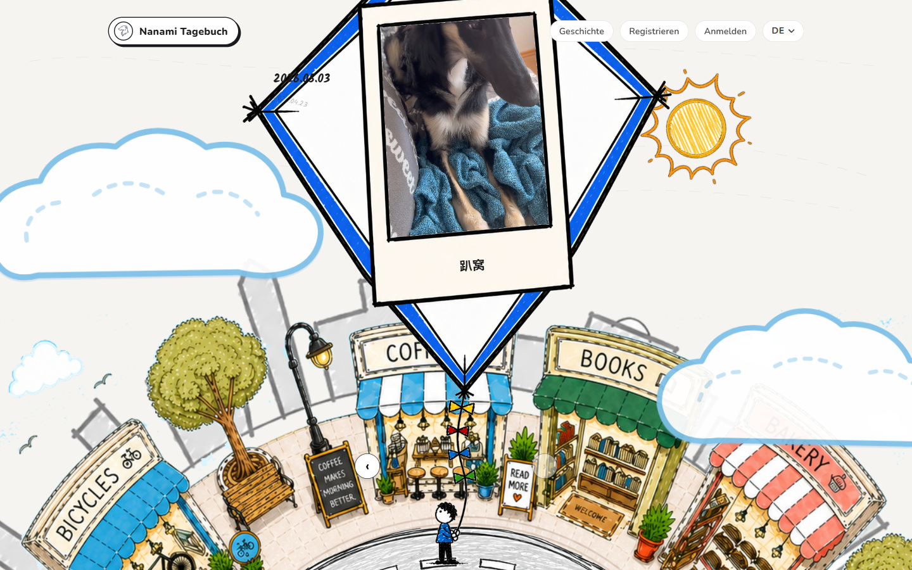
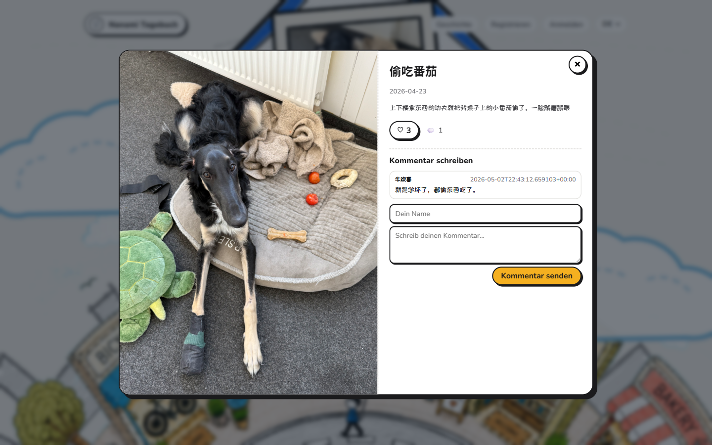
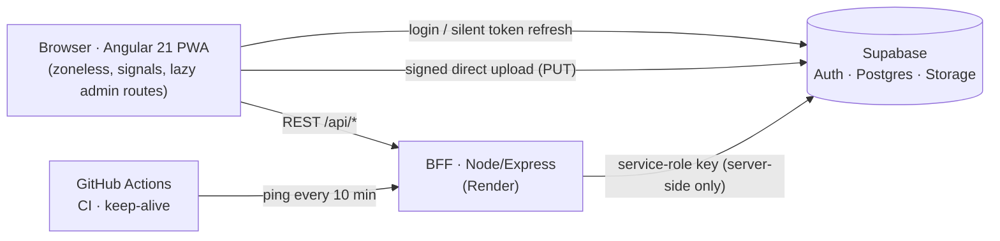

<div align="center">

# Nanami Journal 🐕

**A hand-drawn, interactive journal for Nanami the borzoi — built as a full-stack PWA and run entirely on free-tier cloud.**

[](https://github.com/ZhaoyuWu/Website-Nanami/actions/workflows/tests.yml)
[](https://github.com/ZhaoyuWu/Website-Nanami/actions/workflows/keep-alive.yml)
[](LICENSE)


**Live demo → [nanami-live.vercel.app](https://nanami-live.vercel.app)**



<table>
  <tr>
    <td align="center" width="62%">
      <br/>
      <sub>Entry detail — anonymous likes &amp; comments, rate-limited per IP</sub>
    </td>
    <td align="center" width="38%">
      <br/>
      <sub>Fully responsive, installable as a PWA</sub>
    </td>
  </tr>
</table>

</div>

## What it does

The homepage is a single-viewport, hand-drawn scene: a rotating shop-ring town you can drag,
a walking dog, and a kite that carries the journal's photos and stories — swipe or drag it to
browse the timeline. The scene switches between day and night with your local time.

- 📖 **Journal timeline** — photos, videos, and text posts, ordered by a user-chosen display date
- ❤️ **Likes & comments** — anonymous-friendly, per-IP rate limited, records survive restarts
- 🌍 **Trilingual** — German / English / Chinese with automatic detection
- 📱 **PWA** — offline caching, home-screen install, in-app update prompt
- 🔐 **Admin CMS** — role-based (Admin / Publisher / Viewer): media uploads, story posts,
  site settings, user role management, storage-quota banner

## Architecture



The Express layer is a thin **backend-for-frontend**: it keeps the Supabase service-role key
off the client, enforces validation and rate limits, and owns the privileged flows
(role management, upload finalization, settings).

## Engineering highlights

- **Zoneless Angular with signals** — no zone.js; async state lives in signals/`computed`,
  so change detection is explicit and cheap. Admin bundles are lazy-loaded
  (~98 kB initial transfer).
- **Direct-to-storage uploads** — the backend signs a short-lived upload URL, the browser
  PUTs the raw file straight to Supabase Storage, then the backend verifies the object's
  existence and true size before writing metadata. No file ever buffers through the API.
- **Resilient auth** — sessions refresh silently before expiry; a central `apiFetch`
  wrapper injects the bearer token and retries exactly once after a 401 refresh.
- **Abuse controls** — per-IP cooldown + window ceilings on anonymous likes and comments
  (`429` + `Retry-After`), strict MIME/size allowlists, hardened response headers.
- **Free-tier operations** — a scheduled GitHub Action pings the backend every 10 minutes:
  it keeps the Render instance awake, keeps the Supabase free project from pausing,
  and its failure e-mails double as uptime alerting. Monthly cost: **0 €**.
- **127 automated tests** — 58 backend (`node:test`, Supabase mocked at the fetch seam)
  and 69 frontend (Vitest), all run in CI on every push together with ESLint and a production build.

## Tech stack

| Layer | Choices |
| --- | --- |
| Frontend | Angular 21 (standalone, zoneless, signals), SCSS, Angular Service Worker |
| Backend | Node.js 22, Express 5 |
| Platform | Supabase (GoTrue auth, Postgres, Storage), Vercel, Render |
| Testing | node:test, Vitest, GitHub Actions CI |

## Getting started

```bash
# backend
cd backend && cp .env.example .env   # add your Supabase project keys
npm ci && npm run dev                # http://localhost:4000

# frontend (second terminal)
cd frontend && npm ci && npm start   # http://localhost:4200
```

Full setup, database migrations, deployment, and the smoke checklist:
**[docs/DEVELOPMENT.md](docs/DEVELOPMENT.md)**

## Development notes

Built in an AI-assisted workflow (Claude-family agents for implementation and review,
visible in the commit history) with human architectural decisions, code review, and a
hard rule: nothing ships without the full test suite and a production build passing.

## License

[MIT](LICENSE) — photos of Nanami remain hers, obviously.
